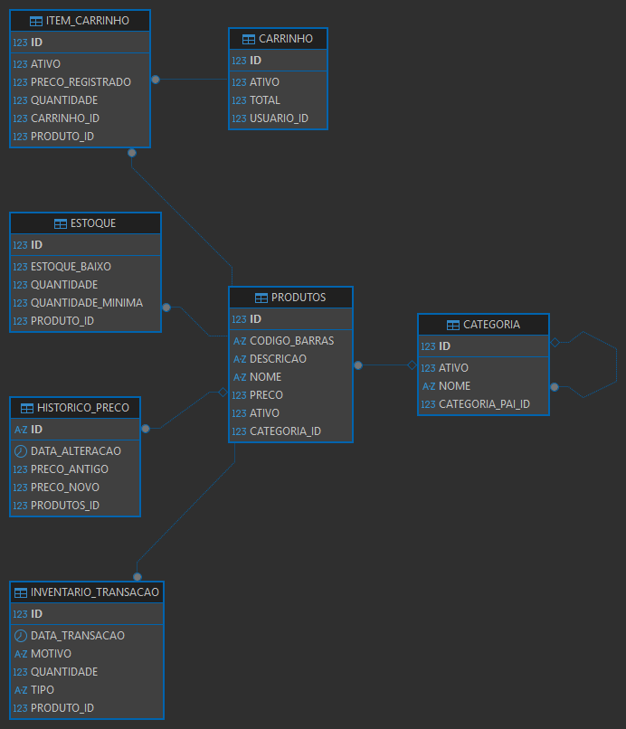

# 🛒 JP Capacitação 2026 - API REST
API REST desenvolvida em Java com Spring Boot para gerenciamento de produtos, estoque, carrinho de compras, categorias e pedidos.

---

## 🌿 Organização das Branches
Cada funcionalidade foi desenvolvida em uma branch separada, seguindo boas práticas de versionamento:

| Branch | Descrição |
|---|---|
| `main` | Código estável e revisado |
| `feature/estoque` | Módulo de Estoque e InventarioTransacao |
| `feature/carrinho` | Módulo Carrinho e ItemCarrinho |
| `feature/categoria` | Entidade Categoria completa |
| `feature/pedido` | Módulo Pedido e ItemPedido |

> Após validação, cada branch foi mergeada na `main` via Pull Request.

---

## 📊 Diagrama de Entidades


---

## 🚀 Tecnologias
- Java 22
- Spring Boot 3.5
- Spring Data JPA
- Hibernate
- Oracle XE 21c
- DBeaver
- Swagger / OpenAPI 3
- Postman (testes)

---

## 📦 Módulos da API

| Módulo | Descrição |
|---|---|
| Produtos | CRUD completo de produtos |
| Categorias | Gerenciamento de categorias e subcategorias |
| Estoque | Controle de entradas, saídas e devoluções |
| Carrinho | Ciclo de vida do carrinho de compras |
| Pedido | Checkout, consulta e cancelamento de pedidos |

---

## 🗂️ Entidades e Regras de Negócio

### 🛍️ Produtos
- Cadastro completo com nome, descrição, preço e código de barras
- Delete lógico via campo `ativo`
- Relacionamento com `Categoria`
- Histórico de alterações de preço registrado automaticamente via `HistoricoPreco`

### 🏷️ Categoria
- Suporte a categorias pai e filhas (hierarquia)
- Delete lógico via campo `ativo`
- Relacionamento com `Produtos`

### 📦 Estoque
- Criação automática de estoque ao cadastrar um produto
- Controle de quantidade mínima com flag `estoqueBaixo`
- Todas as movimentações geram um registro em `InventarioTransacao`

### 📋 InventarioTransacao
- Registra todas as movimentações de estoque
- Tipos: `ENTRADA`, `SAIDA`, `DEVOLUCAO`
- Vinculada ao produto movimentado

### 🛒 Carrinho
- Cada usuário possui no máximo um carrinho `ATIVO` por vez
- Ao finalizar um pedido, o carrinho vai para `FINALIZADO`
- Pode ser cancelado manualmente, indo para `CANCELADO`
- Recalcula o total automaticamente a cada adição, atualização ou remoção de item
- **Status possíveis:** `ATIVO`, `FINALIZADO`, `CANCELADO`

### 🧺 ItemCarrinho
- Vinculado a um `Carrinho` e a um `Produto`
- Registra o preço no momento da adição (`precoRegistrado`)
- Delete lógico via campo `ativo`

### 📝 Pedido
- Criado a partir do carrinho ativo do usuário
- Valida estoque disponível antes de confirmar
- Calcula o total automaticamente: `(itens × preço) + frete - desconto`
- Ao ser criado, baixa o estoque e registra transações de `SAIDA`
- Cancelamento devolve o estoque e registra transações de `DEVOLUCAO`
- Só pode ser cancelado se estiver com status `CRIADO` ou `PAGO`
- **Status possíveis:** `CRIADO`, `PAGO`, `ENVIADO`, `ENTREGUE`, `CANCELADO`

### 📦 ItemPedido
- Gerado automaticamente a partir dos itens do carrinho no momento do checkout
- Registra o preço no momento da compra (`precoRegistrado`)
- Vinculado a um `Pedido` e a um `Produto`

---

## ⭐ Implementações em Destaque

### 🗂️ Mapeamento com Stream — `HistoricoProdutoDTO`
Transformação da lista de histórico de preços utilizando `Stream.map()` e `Collectors.toList()`, retornando os dados de forma estruturada via DTO.

### 🔍 Tratamento de Erros com `orElseThrow`
Adicionado tratamento de exceção nos métodos `getById` e `atualizaPreco` do `ProdutoService`, lançando `RuntimeException` com mensagem clara caso o produto não seja encontrado.

### 🗑️ Delete Lógico em Todas as Entidades
Em vez de remover fisicamente os registros do banco, o sistema marca o registro como inativo através de um campo `ativo`. Os dados continuam existindo, mas ficam invisíveis para o sistema — garantindo rastreabilidade e integridade dos dados.

### 🏷️ Entidade Categoria Completa
Implementação do zero da entidade `Categoria` com suporte a categorias filhas, incluindo `CategoriaService`, `CategoriaRepository`, `CategoriaController` e `CategoriaNotFoundException`.

### 🛒 Módulo Carrinho + ItemCarrinho
Gerenciamento completo do ciclo de vida do carrinho de compras, com relacionamentos JPA entre `Carrinho` e `ItemCarrinho`, serialização controlada para evitar referências circulares e controle de status (`ATIVO`, `FINALIZADO`, `CANCELADO`).

### 📦 Módulo Estoque + InventarioTransacao
Controle completo do estoque com criação automática de estoque inicial, registro de entradas, saídas e devoluções, controle de estoque baixo e relacionamentos JPA com serialização controlada.

### 🧾 Módulo Pedido + ItemPedido
Implementação completa do fluxo de checkout: validação de estoque, cálculo automático de total, baixa de estoque com registro de transações, cancelamento com devolução ao estoque e controle de status do pedido.

---

## 📄 Documentação da API
Com a aplicação rodando, acesse:
```
http://localhost:8080/swagger-ui.html
```

---

## ▶️ Como Executar
```bash
# Clone o repositório
git clone https://github.com/lucascarl011/indra_lucas_carlos_batista_JP2026

# Configure o banco de dados no application.properties

# Rode a aplicação
./mvnw spring-boot:run
```

---

## 👨‍💻 Autor
**Lucas Carlos Batista**

[](https://www.linkedin.com/in/lucascarlos-b-brito/)
[](https://github.com/lucascarl011)