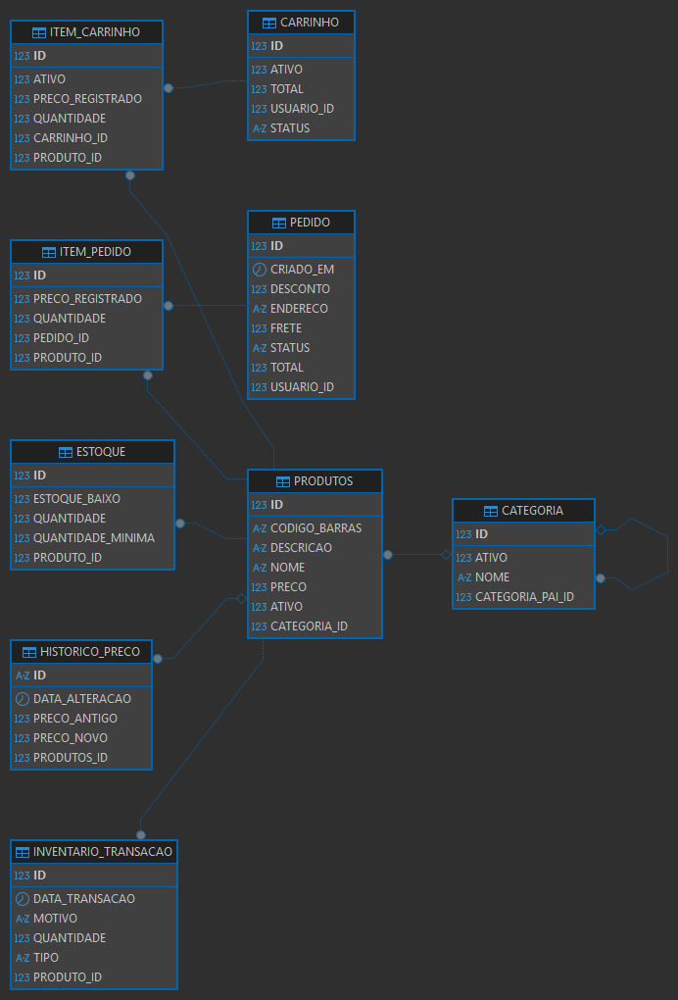
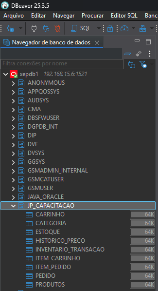

# 🛒 JP Capacitação 2026 - API REST

API REST desenvolvida em Java com Spring Boot para gerenciamento de produtos, estoque, carrinho de compras, categorias e pedidos.

---

## 🌿 Organização das Branches

Cada funcionalidade foi desenvolvida em uma branch separada, seguindo boas práticas de versionamento:

| Branch | Descrição |
|---|---|
| `main` | Código estável e revisado |
| `feature/estoque` | Módulo de Estoque e InventarioTransacao |
| `feature/carrinho` | Módulo Carrinho e ItemCarrinho |
| `feature/categoria` | Entidade Categoria completa |
| `feature/pedido` | Módulo Pedido e ItemPedido |

> Após validação, cada branch foi mergeada na `main` via Pull Request.

---

## 🏗️ Arquitetura

A aplicação segue o padrão em camadas:

- **Controller** → Responsável pelas requisições HTTP
- **Service** → Contém as regras de negócio
- **Repository** → Comunicação com o banco de dados
- **Model** → Representação das tabelas do banco
- **Mappers** → Conversão entre entidades e DTOs (Request/Response)
- **Exception** → Tratamento centralizado de erros da aplicação
- **Config** → Configurações gerais da aplicação (ex: Swagger, CORS)
- **DTOs** → Objetos de transferência de dados (Request e Response), localizados dentro de `service/dto`
---

## 📊 Diagrama de Entidades



O sistema é baseado em relacionamentos entre Produto, Categoria, Carrinho e Pedido, onde o fluxo principal parte do carrinho até a geração do pedido, impactando diretamente o estoque.

---

## 🚀 Tecnologias

- Java 22
- Spring Boot 3.5
- Spring Data JPA
- Hibernate
- Oracle XE 21c
- DBeaver
- Swagger / OpenAPI 3
- Postman (testes)

---

## 📦 Módulos da API

| Módulo | Descrição |
|---|---|
| Produtos | CRUD completo de produtos |
| Categorias | Gerenciamento de categorias e subcategorias |
| Estoque | Controle de entradas, saídas e devoluções |
| Carrinho | Ciclo de vida do carrinho de compras |
| Pedido | Checkout, consulta e cancelamento de pedidos |

---

## 🗂️ Entidades e Regras de Negócio

### 🛍️ Produtos
- Cadastro com nome, descrição, preço e código de barras
- Delete lógico via campo `ativo`
- Relacionamento com `Categoria`
- Histórico de preço via `HistoricoPreco`

### 🏷️ Categoria
- Hierarquia de categorias (pai/filha)
- Delete lógico
- Relacionamento com produtos

### 📦 Estoque
- Criado automaticamente ao cadastrar produto
- Controle de estoque mínimo (`estoqueBaixo`)
- Movimentações registradas em `InventarioTransacao`

### 📋 InventarioTransacao
- Registra movimentações de estoque
- Tipos: `ENTRADA`, `SAIDA`, `DEVOLUCAO`

### 🛒 Carrinho
- Um carrinho ativo por usuário
- Status: `ATIVO`, `FINALIZADO`, `CANCELADO`
- Recalcula total automaticamente

### 🧺 ItemCarrinho
- Vinculado ao carrinho e produto
- Registra preço no momento da adição
- Delete lógico

### 📝 Pedido
- Criado a partir do carrinho
- Valida estoque antes de confirmar
- Calcula total automaticamente
- Baixa estoque ao criar
- Cancelamento devolve estoque

**Status:** `CRIADO`, `PAGO`, `ENVIADO`, `ENTREGUE`, `CANCELADO`

### 📦 ItemPedido
- Gerado no checkout
- Registra preço da compra
- Vinculado ao pedido e produto

---

## 🔐 Segurança

Atualmente a API não possui autenticação, mas está preparada para integração com **JWT + Spring Security**.

---

## 🧪 Testes

Os testes estão em desenvolvimento, com foco em testes unitários utilizando **JUnit e Mockito**.

---

## 📄 Documentação da API

Com a aplicação rodando, acesse:

http://localhost:8080/swagger-ui/index.html

---

## 📌 Exemplos de Requisição

### ➤ Criar Produto

POST /produtos
```json
{
  "nome": "Notebook",
  "descricao": "Notebook Dell i5",
  "preco": 3500.00,
  "codigoBarras": "123456789"
}
```
➤ Resposta
```json
{
"id": 1,
"nome": "Notebook",
"preco": 3500.00
}
```

---

## ⭐ Implementações em Destaque
- Uso de Stream API para transformação de dados com DTO
- Tratamento de erros com orElseThrow
- Implementação de Delete Lógico em todas as entidades
- Relacionamentos JPA com controle de serialização
- Fluxo completo de carrinho e pedido
- Controle de estoque com rastreabilidade de transações

---

## ▶️ Como Executar
```bash
# Clone o repositório
git clone https://github.com/lucascarl011/indra_lucas_carlos_batista_JP2026

# Configure o banco de dados no application.properties
spring.datasource.url=jdbc:oracle:thin:@localhost:1521:XE
spring.datasource.username=SEU_USUARIO
spring.datasource.password=SUA_SENHA

# Rode a aplicação
./mvnw spring-boot:run
```

---

## Banco de Dados Oracle



---

## 👨‍💻 Autor
**Lucas Carlos Batista**

[](https://www.linkedin.com/in/lucascarlos-b-brito/)
[](https://github.com/lucascarl011)

